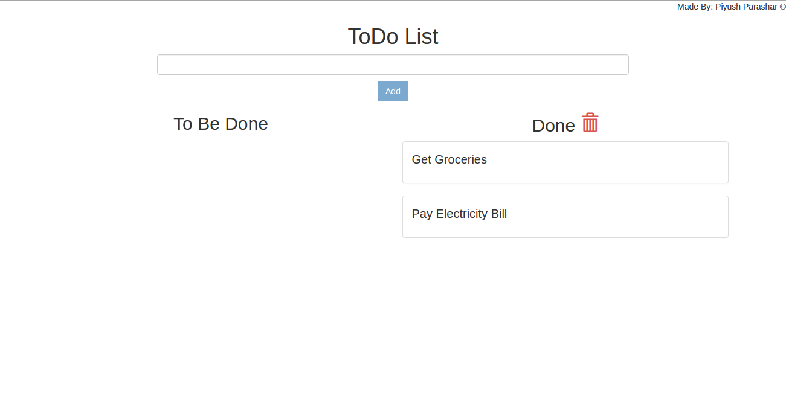

# Angular - Todo list

HTML, CSS, Bootstrap, Angular

1. Add the work to be done in the input field and click on Add button.
2. It will be shown under "To Be Done" heading.
3. When done click on the tick mark and it will show under "Done" heading;
4. If you want to clear the Done list, click on the red Trash symbol to clear it.

Highlights

1. Auto focus on the input field after addition of task to be done to make it easier for the user to add continuous tasks, one    after the another.
2. No empty entry allowed

# Screenshots

